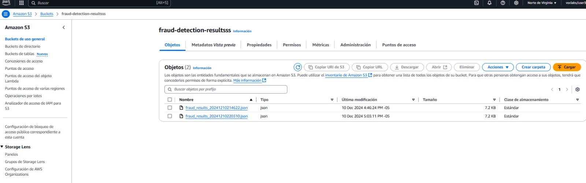

# Financial Fraud Prevention System

## Project Overview

This repository contains the implementation of a real-time fraud detection pipeline using AWS services. The system processes financial transactions to identify potentially fraudulent activities using predefined rules. Key AWS services include Kinesis Data Streams, AWS Lambda, and S3.

---

## Architecture

The architecture of this project is as follows:


1. **Data Source**: Financial transaction data is sent to Kinesis Data Streams.
2. **Event Processing**: A Lambda function processes the incoming data, applying fraud detection logic.
3. **Data Storage**: Results of the processing (e.g., flagged fraudulent transactions) are stored in an S3 bucket for further analysis.

---

## Components

### 1. **Kinesis Data Stream**


- Stream Name: `transaction-stream`
- Mode: On-Demand
- Retention Period: 1 Day
- ARN: `arn:aws:kinesis:us-east-1:1664729618295:stream/transaction-stream`

### 2. **AWS Lambda Function**


- Name: `fraud-detection-processor`
- Runtime: Python 3.x
- Source File: `lambda_function.py`
- Key Logic:
  - **High Transaction Amount**: Flags transactions above $10,000.
  - **Frequent Transactions**: Flags accounts with more than 3 transactions within a minute.
  - **Cross-Border Transactions**: Flags transactions where the destination country differs from the origin.
  - **Low Balance with High Transaction**: Flags high-value transactions with low account balance.

### 3. **Amazon S3 Bucket**



- Name: `fraud-detection-resultsss`
- Stored Data: JSON files containing flagged transactions.

## Setup Instructions

### Prerequisites

- Python 3.x installed locally for Lambda development.
- AWS SDK (`boto3`) for Python.

### Steps

1. **Create Kinesis Data Stream**:

   ```bash
   aws kinesis create-stream --stream-name transaction-stream --stream-mode ON_DEMAND
   ```
2. **Deploy Lambda Function**:

   - Zip the Lambda function:
     ```bash
     zip function.zip lambda_function.py
     ```
   - Deploy to AWS:
     ```bash
     aws lambda create-function \
         --function-name fraud-detection-processor \
         --runtime python3.x \
         --role <IAM_ROLE_ARN> \
         --handler lambda_function.lambda_handler \
         --zip-file fileb://function.zip
     ```
3. **Configure S3 Bucket**:

   - Create the S3 bucket:
     ```bash
     aws s3api create-bucket --bucket fraud-detection-resultsss --region us-east-1
     ```
4. **Connect Kinesis to Lambda**:

   - Add Kinesis as a trigger to the Lambda function via the AWS Console or CLI.

---

## Testing


- Use the AWS Console to create test events for the Lambda function.
- Verify output JSON files in the S3 bucket.

---

## Future Enhancements

- Implement machine learning models for more advanced fraud detection.
- Extend retention period of the Kinesis Data Stream.
- Integrate notifications (e.g., AWS SNS) for flagged transactions.

## Authors

* **Alexandra Cortes Tovar** - [alexandrac1420](https://github.com/alexandrac1420)
* **Jose Ricardo Vasquez Vega** - [Richi025](https://github.com/Richi025)
* **Juan Sebastian Vasquez Vega** - [Sebasvasquezz](https://github.com/Sebasvasquezz)

## Date

Friday, December 13, 2024

## License

This project is licensed under the MIT License. See the `LICENSE` file for details.
